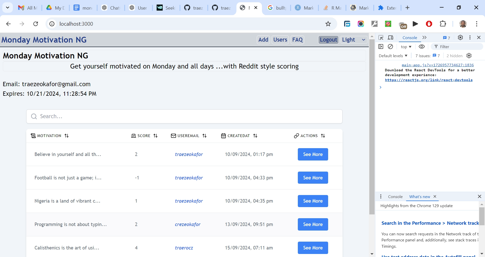

# Nigerian Inflation Tracker 2024

My goal for this project was to create a responsive application with a strong emphasis on user experience, data visualization, secure authentication, and data persistence. To achieve this, I aimed to integrate APIs, implement robust data handling, and leverage state management tools, all while ensuring reliable backend storage for data preservation. In all I'm practicing and developing my coding competency by building projects after projects.

## Table of contents

- [Overview](#overview)
  - [The challenge](#the-challenge)
  - [Screenshot](#screenshot)
  - [Links](#links)
  - [My process](#my-process)
  - [Built with](#built-with)
  - [What I learned](#what-i-learned)
  - [Continued development](#continued-development)
  - [Useful resources](#useful-resources)
  - [Author](#author)
  - [Acknowledgments](#acknowledgments)

## Overview

### The Challenge/User Stories

- User should be able to log in with GitHub or Google.  
- User should be able to view crowdsourced inflation data on the homepage.  
- User should be able to view inflation data by category (purchase purpose).  
- User should be able to view inflation data by Nigerian State.  
- User should be able to view data by individual users to see reporting trends.  
- User should be able to add new inflation data listings.  
- User should be able to edit their own inflation data listings.  
- User should be able to delete their own inflation data listings.  
- User should be able to switch between light and dark themes.  
- User should be able to access the project source code and view other projects by the website admin.   

### Screenshot

### Links

- Solution URL: [https://github.com/traez/nigerian-inflation-tracker-2024](https://github.com/traez/nigerian-inflation-tracker-2024)
- Live Site URL: [https://nigerian-inflation-tracker-2024.vercel.app/](https://nigerian-inflation-tracker-2024.vercel.app/)

## My process

### Built with

- Semantic HTML5 markup
- CSS custom properties
- Flexbox and CSS Grid
- Mobile-first workflow
- [React](https://reactjs.org/) - JS library
- [Next.js](https://nextjs.org/) - React framework
- Tailwind CSS
- Typescript
- Nodejs  
- MongoDB/Mongoose     
- Auth.js (NextAuth)  
- Shadcn UI      
- react-hook-form      
- Tanstack     
- react-icons     
- sonner  
- uuid  
- zod       

### What I learned
   
- **File Extensions for JavaScript and JSX**  
Use .js for files containing plain JavaScript without JSX syntax.  
Use .jsx for files that include JSX, embedding HTML-like syntax directly within JavaScript.  
For TypeScript, use .tsx and .ts      
- **UUID Package Installation**  
`npm install uuid` to generate unique identifiers.  
`npm i @types/uuid` for TypeScript projects, providing type definitions and enhancing code completion and type checking.  
- **Global State Management vs. Server-Side Rendering (SSR)**  
In purely front-end development, tools like Redux Toolkit and Context API were essential for managing global state.  
Transitioning to full-stack development with SSR changes the approach: global state management becomes less critical, with user preferences and state managed through database storage, props, cookies, and URL parameters.    
- **Handling MongoDB ObjectId Serialization**  
Encountered an issue with MongoDB’s ObjectId not being serializable to JSON, causing client-side errors.  
Resolved by modifying server actions to return plain objects, excluding MongoDB-specific types, ensuring compatibility and avoiding serialization issues.      
- **Sonner vs. React-Toastify for Notifications**  
Explored using Sonner for toast notifications as an alternative to React-Toastify.  
- **Future Enhancements**   
Authentication: Separate registration and login functionalities for a more user-friendly experience.    
- **Responsive Design Best Practices**  
Adopted design strategies for three breakpoints (320px, 640px, 1280px) in Figma, with the first as an edge case and the latter two as Tailwind CSS defaults.    
- **Tanstack Tables**  
Gained experience working with Tanstack Tables, deepening my understanding of table management in React.    
- **React Imports and Namespace Usage**  
`import * as React from "react"`; is beneficial in TypeScript projects or specific build environments, ensuring all React components, hooks, and utilities are accessible under the React namespace.    
Additionally, this import style supports efficient tree-shaking, allowing bundlers to remove unused code and optimize the final output. It also ensures compatibility with various build tools and older configurations, making it a versatile choice for both modern and legacy React projects.   
- **Comprehensive Understanding of Full-Stack Development**  
Completing this project provided clarity on the practical use of server components alongside client components.  
Gained confidence in how authentication, backend storage, data fetching, and UI responsiveness work together in a full-stack app—areas I was previously uncertain about.  

### Continued development

- More projects; increased competence!

### Useful resources

Stackoverflow  
YouTube  
Google  
ChatGPT

## Author

- Website - [Trae Zeeofor](https://github.com/traez)
- Twitter - [@trae_z](https://twitter.com/trae_z)

## Acknowledgments

-Jehovah that keeps breath in my lungs
